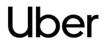
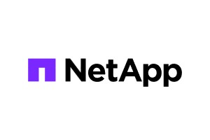

# ADOPTERS

This document lists organizations, companies, and individuals that are using Cadence in production or evaluation environments.
If you are using Cadence, please consider adding yourself to this list by opening a pull request or contacting the maintainers. See more instructions at the end of this page.
Your support helps us understand our user community and prioritize improvements.

## Production Users

### Uber Technologies

Uber has over 2000 use cases (Cadence domains) powered by Cadence. Here are some examples:

- **Infrastructure**: service & config rollout, CD pipelines, health checks & rollbacks, DB maintenance, bad node detection / replacement, compaction, DB backup / restore, migration orchestration, ...
- **ML / AI**: Agent orchestration, model training, data pipelines, fare estimation, ...
- **Finance**: payments, tips, disputes, bank verification, account onboarding, promotions, discounts, partnerships, gifting, billing / invoicing, loyalty points, ...
- **Product**: earner eligibility, onboarding, periodic document & compliance checks, document processing, vehicle management, inventory / catalog management, image processing, ads, repeat orders, vouchers, spending tracking, notifications, analytics, trip reports, ...

There are 20+ environments running Cadence where some of them hosts 400+ domains.

### NetApp

At [NetApp](https://www.netapp.com) we use Cadence as a key component of the Instaclustr platform’s control plane architecture. Our automated maintenance system relies on Cadence to orchestrate and schedule maintenance across tens of thousands of hosts in our managed fleet. By adopting Cadence we’ve been able to offer both our engineers and customers high-throughput, fault-tolerant execution of critical fleet operations.

NetApp is the intelligent data infrastructure company, providing solutions to manage any data, for any application, anywhere it is needed. Through the [Instaclustr](https://www.instaclustr.com) platform we offer fully managed Cadence, including automated provisioning of supporting infrastructure such as Apache Cassandra, Apache Kafka, and OpenSearch.

## Evaluating / Early Adopters

## How to Add Your Organization

- Fork this repository.
- Edit this file (ADOPTERS.md).
- Add your organization under the relevant section.

### Adding Your Logo

- If you would like your organization’s logo to appear on the Cadence website, repositories and documentation:
- Add your logo file (preferably in JPG/JPEG format) to the /logos directory in the repository.
- Name the file using lowercase letters and hyphens (for example: acme-corp.svg).
- Keep your image dimensions less than 300 pixels in width and 200 pixels in height.
- Update ADOPTERS.md to include your logo and link to your organization’s website.
- Logos should be submitted only by verified representatives or with permission from the organization.

Open a pull request with the title: Add \<Your Organization\> to ADOPTERS.md.
